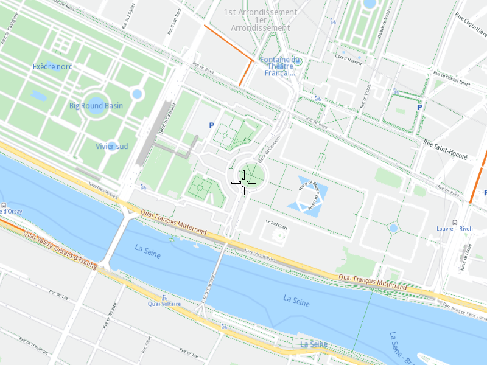

## Overview

This example app demonstrates the following features:
- Center the map view over a pair of coordinates.

## How to use the sample

When you run the example app, you'll be viewing the scene from above. The map view will move over the given set of coordinates.

## How it works

1. Create a `MapServiceListener`, `OpenGLContext`, `Screen` and `MapView`.
2. Instruct the `MapView` to center on desired coordinates.
3. Allow the application to run until the map view is fully loaded.
