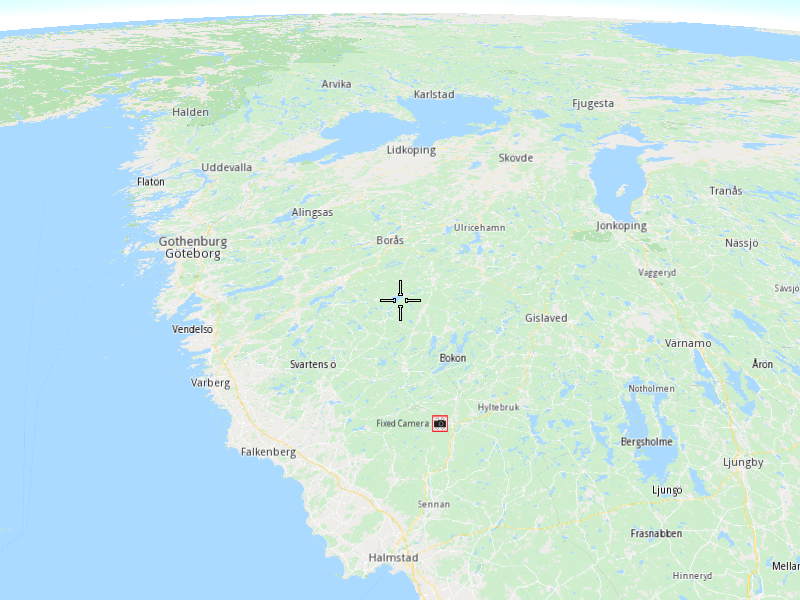

## Overview

This example app demonstrates the following features:
- Change the map perspective to a more suitable perspective.

## How to use the sample

When you run the example app, you'll be viewing the scene from above in 2D. The map view perspective will then switch to 3D.

## How it works

1. Create a `MapServiceListener`, `OpenGLContext`, `Screen` and `MapView`.
2. Instruct the `MapView` to change its perspective to 3D.
3. Allow the application to run until the map view is fully loaded.
