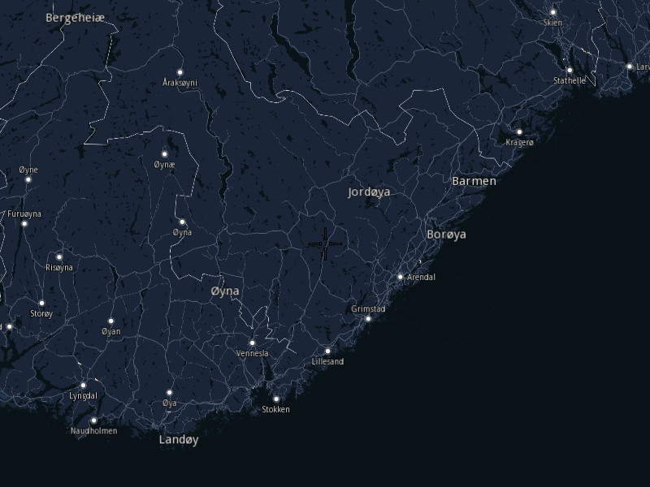

## Overview

This example app demonstrates the following features:
- Change the map style to a more suitable one.

## How to use the sample

When you run the example app, you'll be viewing the scene from above. The map style will be different than in the previous examples.

## How it works

1. Create a `MapServiceListener`, `OpenGLContext`, `Screen` and `MapView`.
2. Using a progress listener instruct the ContentStore to bring the `ContentList`. Wait for the operation to finish.
3. Get the `ContentList` of styles.
4. If unavailable locally, download the missing styles.
5. Set the desired style in the preferences of the `MapView`.
