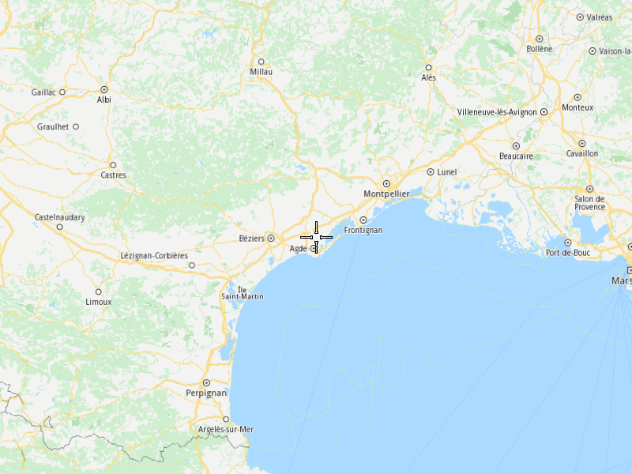

## Overview

This example app demonstrates the following features:
- Present an area of the world map in a window.

## How to use the sample

When you run the example app, you'll be viewing the scene from above.

## How it works

1. Create a `MapServiceListener`, `OpenGLContext`, `Screen` and `MapView`.
2. Allow the application to run until the map view is fully loaded.
