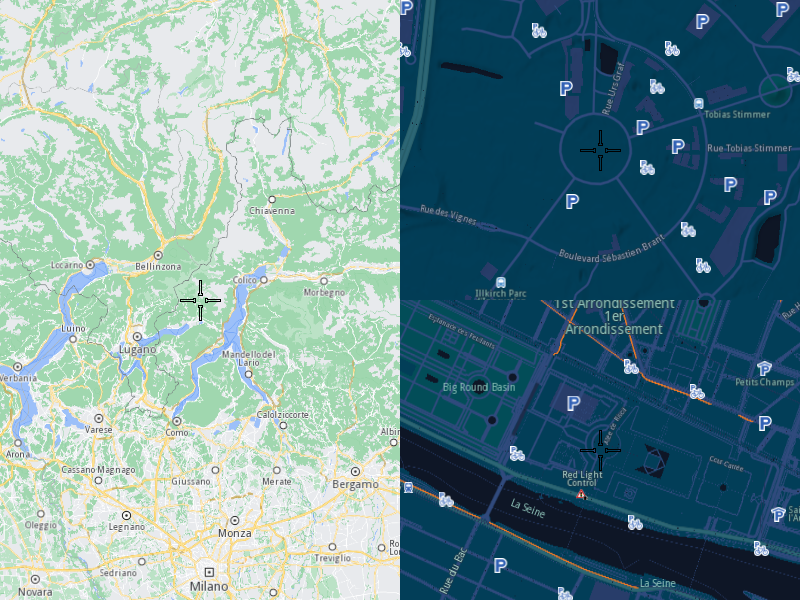

## Overview

This example app demonstrates the following features:
- Show multiple map views.

## How to use the sample

When you run the example app, you'll be viewing the scene from above. The scene will be displayed in two views.
For highlight purposes a different style is set to the 2nd view, if available.

## How it works

1. Create two `MapServiceListener` objects, one `OpenGLContext`, a `Screen` and two `MapView` objects.
2. Allow the application to run until the map views are fully loaded.
