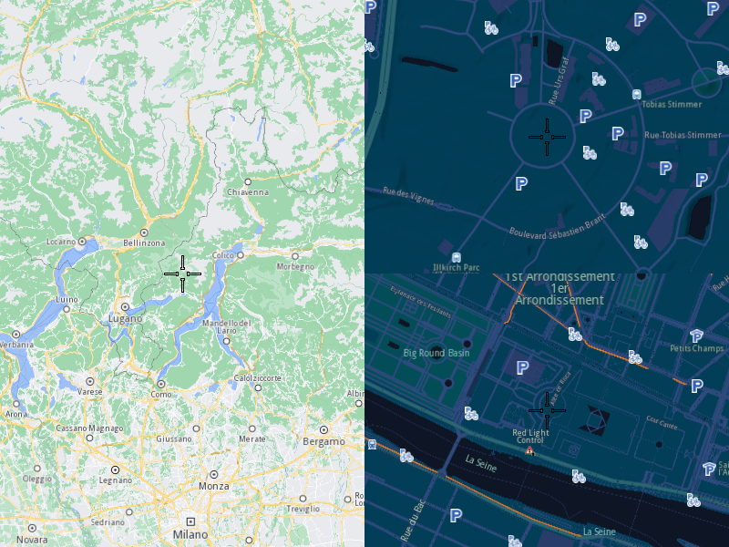

## Overview

This example app demonstrates the following features:
- Show multiple map views.

## How to use the sample

When you run the example app, you'll be viewing the scene from above. The scene will be displayed in three views: one filling the left half of the window, and two stacked in the right half. Two of the views center on different cities (Paris and Strasbourg).
For highlight purposes a different map style is set to each view, if enough styles are available.

## How it works

1. Create a `MapServiceListener`, an `OpenGLContext` and a `Screen`.
2. Create three `MapView` objects on the same screen, each with its own normalized viewport rectangle (`gem::RectF`): the left half, the top-right quarter and the bottom-right quarter.
3. Center two of the views on different coordinates and set a different map style to each view, if enough styles are available locally.
4. Allow the application to run until the map views are fully loaded.
