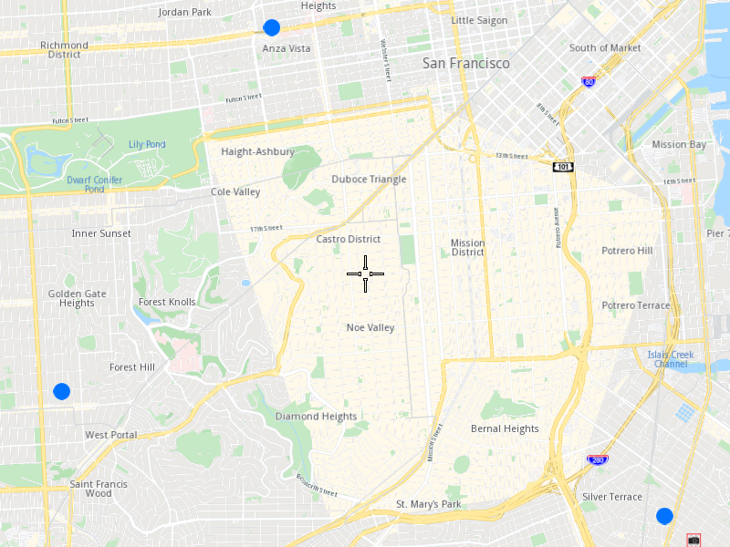

## Overview

This example app demonstrates the following features:
- Show a collection of points on map.

## How to use the sample

When you run the example app, you'll be viewing the scene from above. A collection of three points will be visible as well.

## How it works

1. Create a `MapServiceListener`, `OpenGLContext`, `Screen` and `MapView`.
2. Create a `MarkerCollection` of type `Point` and add the desired coordinates to it.
3. Set the newly created `MarkerCollection` in the markers collections of the map view preferences.
4. Instruct the `MapView` to center on the area defined by the earlier created `MarkerCollection`.
5. Allow the application to run until the map views are fully loaded.
