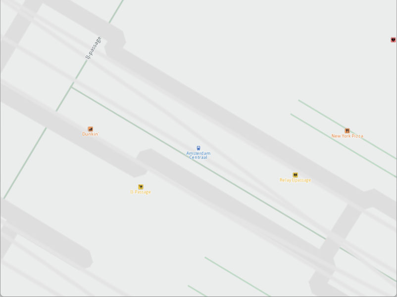

## Overview

This example app demonstrates the following features:
- Print a short public transit stop schedule once a public tranist stop is being long pressed.

## How to use the sample

When you run the example app, you'll be viewing the scene from above. The map view will center over a public transit stop.
Click and hold the left mouse button (or long tap) on top of the public transit stop. Its schedule will be printed to log once fetched.

## How it works

1. A `IMapViewListener` is implemented which handles the `onLongDown` event.
2. A `MapView` is produced and the listener from 1 is passed.
3. The `MapView` centers on a location where a public tranist stop is located.
4. The user must long left click on the centered stop. `onLongDown` event from #1 will get called.
5. We iterate the `cursorSelectionOverlayItems` looking for the public transit stop and once found we request the `previewExtendedData`, we also attach a progress listener to this operation.
6. When the progress listener `notifyComplete` call is received, the schedule is printed.
