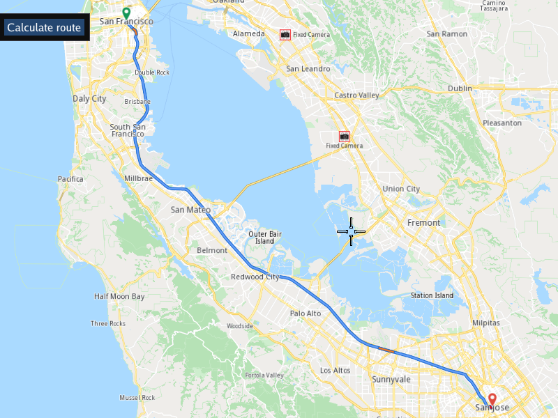

## Overview

This example app demonstrates the following features:
- Calculate a route between two given pairs of coordinates then display it on an interactive map.

## How to use the sample

When the example app is run, the scene is viewed from above. A fly will be performed to the calculated route.

## How it works

1. Create an instance of a `CTouchEventListener` to make the map interactive, enabling touch events such as pan and zoom
2. Create an instance of `MapView` producing an OpenGL context using ImGUI, passing in the touch event listener, and a custom GUI function, `getUiRender`
3. The custom GUI function has a button to calculate a route; latitude, longitude coordinates for a preset departure position, and a preset destination
   position, are given using a `gem::LandmarkList` and then a route is calculated using `gem::RoutingService().calculateRoute()`;
   a `ProgressListener` is used to detect when the route calculation is complete, and if the result, stored using a `gem::RouteList`,
   contains at least one route, the first route, at index 0, is added to the map to be rendered, and the map centers on it, using `mapView->centerOnRoute()`

