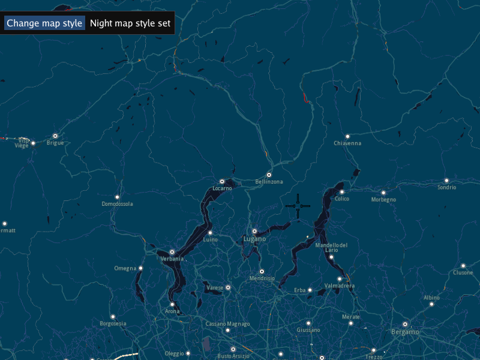

## Overview

This example app demonstrates the following features:
- Shows how to change the map style used to render the map
- Shows how to get the list of map styles from the online content store server

## How to use the sample

Click the button to toggle the interactive map between day/night map styles.

## How it works

The interactive map is rendered using the currently active map style.

The example has a button to interactively toggle between the first day map style and the first night map style
in the list of map styles. If one or both of these styles are not present locally, they are downloaded from
the online content server. The first day (light colored) map style and the first night (dark colored)
map style are autoselected by color.

See the RouteDirectionArrows example to see how to set a map style by local file name path instead.
This is useful for offline operation, and when you create and download your own map style from the online studio.

1. Create an instance of a `CTouchEventListener` to make the map interactive, enabling touch events such as pan and zoom
2. Create an instance of `MapView` producing an OpenGL context using ImGUI, passing in the touch event listener, and a custom GUI function, `getUiRender`
3. The custom GUI function has a button to change the map style; this first looks for the list of map styles locally, in case it has been already
   downloaded, using `gem::ContentStore().getStoreContentList( gem::EContentType::CT_ViewStyleLowRes ).first`
   however, if the list of map styles is not present locally, the function connects to the online content store server and downloads the list of
   map styles using `gem::ContentStore().asyncGetStoreContentList( gem::EContentType::CT_ViewStyleLowRes, &listener );` and a `ProgressListener` is
   used to detect when the resulting list has been received
4. Next, it iterates through the list of map styles, looking at the background color of each style, using
   `style.getContentParameters().findParameter( "Background-Color" )` in order to find the first day map style, by checking if the background
   color is light, using `gem::Rgba( backGroundColor.getValue<int>() ).isLight()`, and also the first night map style in the list is found
   the same way, by using the logical not of the same condition above;
5. Each time the button is clicked, the map style is set using `mapView->preferences().setMapStyle( nightStyle )`
   alternating between the first day map style in the list and the first night map style in the list of map styles

