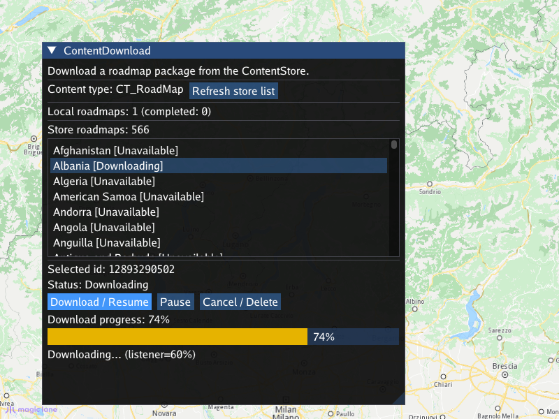

## Overview

This example app demonstrates the following features:
- Show how to download maps, voices and map styles from the MagicLane Online Store for offline use.

## How to use the sample

When the example app is run, an interactive map is shown together with a panel. The list of road map packages
available in the online content store is queried automatically at startup; the `Refresh store list` button repeats
the query on demand. The panel also shows a summary of the road maps already present locally (and how many of them
are completely downloaded).

Selecting an item in the store list shows its id and current status, together with buttons to `Download / Resume`,
`Pause` and `Cancel / Delete` the content, depending on what the current status of the item allows. While a download
is in progress, its percentage is displayed together with a progress bar, and the final result is reported when it
completes. A downloaded map is stored locally and can be used offline.

## How it works

1. Create an instance of a `CTouchEventListener` to make the map interactive, enabling touch events such as pan and zoom
2. Create an instance of `MapView` producing an OpenGL context using ImGUI, passing in the touch event listener, and a custom GUI function, `getUiRender`
3. A state object shared with the UI callback keeps the query status and results alive across frames; the UI callback polls the
   progress listeners every frame, so the UI is never blocked by the asynchronous operations
4. The list of store content is queried using `gem::ContentStore().asyncGetStoreContentList()` with `gem::EContentType::CT_RoadMap`
   and a `ProgressListener`; when the listener reports completion, the results are fetched with `gem::ContentStore().getStoreContentList()`
   and shown in the list (name and status per item)
5. The locally available content summary is obtained with `gem::ContentStore().getLocalContentList()`
6. Downloading a selected `gem::ContentStoreItem` is started with `item.asyncDownload()` and a `ProgressListener`; progress is read with
   `GetProgressValue()` / `item.getDownloadProgress()` and displayed with a progress bar
7. A running download can be paused with `item.pauseDownload()`, and content can be canceled / removed with `item.deleteContent()`
   (enabled according to `item.getStatus()` / `item.canDeleteContent()`)
