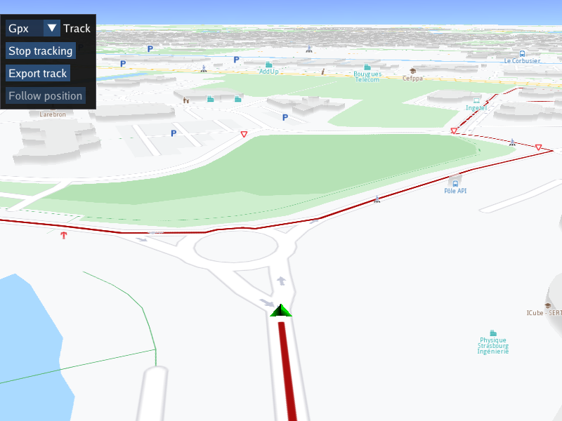

## Overview

This example app demonstrates the following features:
- Playback a pre-recorded navigation GPS-log in NMEA format to use as input, simulating a real navigation
- Display dynamic path tracking/tracing of the traveled path on an interactive map
- Save the track in a desired format, such as `.gpx`, `.kml`, `.geojson` or `.nmea`

## How to use the sample

When the example app is run, the pre-recorded navigation GPS-log in NMEA format starts playing automatically, simulating real travel along a road.
Clicking the `Start tracking` button causes the traveled path to be traced along the road, starting from the time the button was clicked.

The `Follow position` button is active if the camera is not following the green position arrow indicator, for example,
if the map is panned/moved to one side, to enable resuming follow position mode.

There is also a button to `Export track`, that is, save the track traced so far (if tracking is active), in the format selected from the
drop-down combo box at the top. The default format is `GPX`, but other formats such as `KML`, `NMEA`, `GeoJSON` or text are supported as well.
A new filename is generated automatically each time the track is saved, based on the date, time and selected output format.

## How it works

A pre-recorded NMEA position log of a navigation file is loaded, and set as the data source for the position service to simulate actual travel.
This causes the position indicator to play back the previous navigation along the route rendered on the map.

1. Create an instance of a `CTouchEventListener` to make the map interactive, enabling touch events such as pan and zoom
2. Create an instance of `MapView` producing an OpenGL context using ImGUI, passing in the touch event listener, and a custom GUI function, `getUiRender` 
3. The custom GUI function loads the pre-recorded navigation in NMEA format using `gem::sense::DataSourceFactory::produceLog();`
4. The custom GUI function has a button to start rendering a polyline on the interactive map to trace the traveled path; this is a track
   which can be saved in one of several output formats;
5. The custom GUI function has a button to export/save the rendered track, which is enabled when tracking is active; the output format used
   can be selected in the drop-down combo at the top.
   First, the trace/track points defining the polyline rendered so far are obtained:
   `mapView->extensions().getTrackedPositions();`
   then they are converted into a buffer of the desired format, as selected in the drop-down combo:
   `gem::Path(path.first).exportAs(gem::EPathFileFormat(selectedOutputTrackFileExtension));`
   and then the buffer is written out to a file, which has a name generated by the `generateFilename()` function;
   the output file is written in the SDK/Data/Tracks/ directory, where SDK is the absolute path of the SDK install location;
6. There is also a follow position button, to resume following the position indicator along the route, if the map is panned, which causes an exit from
   follow position mode; this is resumed using `mapView->startFollowingPosition();`

