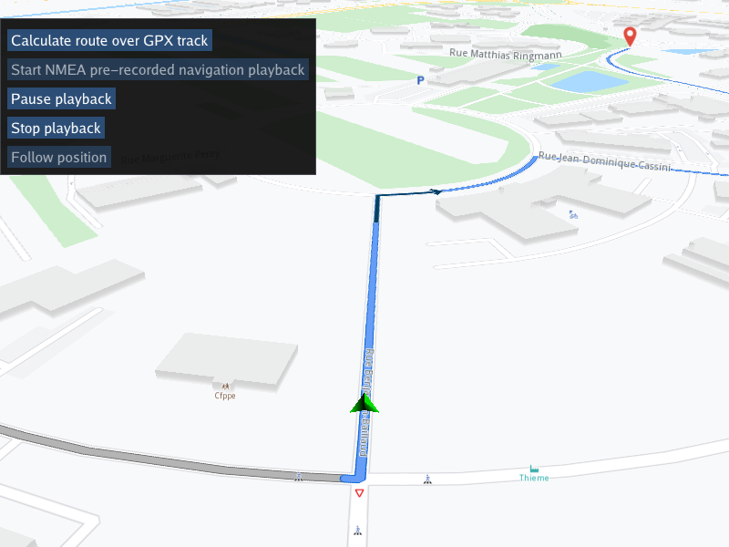

## Overview

This example app demonstrates the following features:
- Show how to calculate and render a route based on a GPX track as input waypoints
- Playback a pre-recorded navigation GPS-log in NMEA format matching the route
- Pause, resume, stop and restart playback
- Use a custom navigation listener to receive navigation events, such as started, waypoint reached, or destination reached

## How to use the sample

When the example app is run, clicking the first button causes a route to be calculated over the GPX track. The second button starts playback of a pre-recorded NMEA position log of a navigation, matching the rendered route.

The follow position button is active if the camera is not following the green position arrow indicator, for example, if the map is panned/moved to one side, to enable resuming follow position mode.
There is also a button to pause/resume navigation playback, and a button to stop it, so it can be restarted from the beginning.

## How it works

A GPX track file containing waypoints is loaded, and the waypoints are used to calculate and render a route on the interactive map.
A matching pre-recorded NMEA position log of a navigation file is loaded, and set as the data source for the position service.
This causes the position indicator to play back the previous navigation along the route rendered on the map.

1. Create a custom navigation listener derived from `gem::INavigationListener` to receive navigation events, such as started, waypoint reached, or destination reached
2. Create an instance of a `CTouchEventListener` to make the map interactive, enabling touch events such as pan and zoom
3. Create an instance of `MapView` producing an OpenGL context using ImGUI, passing in the touch event listener, and a custom GUI function, `getUiRender` 
4. The custom GUI function loads the pre-recorded navigation in NMEA format using `gem::sense::produceLogDataSource();`
5. The custom GUI function has a button to calculate a route; this loads the waypoints from the GPX file using `gem::RouteBookmarks::setWaypointTrackData()`
   and then calculates the route using `gem::RoutingService().calculateRoute()`; a `ProgressListener` is used to detect when the route calculation is complete,
   and if the result, stored using a `gem::RouteList`, contains at least one route, the first route, at index 0, is added to the map to be rendered,
   and the map centers on it, using `mapView->centerOnRoute()`
6. The custom GUI function has a button so the user can start navigation along the route, starting both playback of the NMEA data using
   `dataSourceNMEA.first.get()->start();` and enable navigation, `gem::NavigationService().startNavigation()` with buttons to also pause, resume and stop navigation
7. There is also a follow position button, to resume following the position indicator along the route, if the map is panned, which causes an exit from
   follow position mode; this is resumed using `mapView->startFollowingPosition();`

