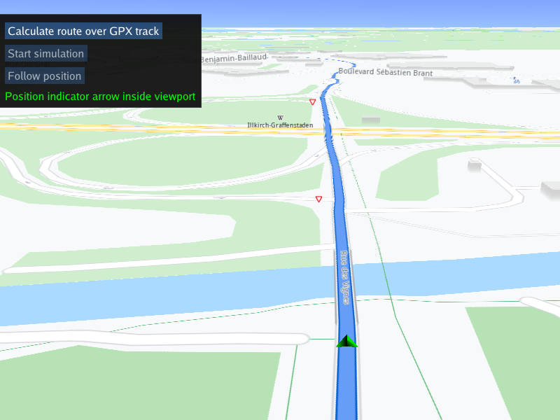

## Overview

This example app demonstrates the following features:
- Show how to calculate and render a route based on a GPX track as input waypoints
- Simulate navigation along the route
- Use a custom navigation listener to receive navigation events, such as started, waypoint reached, or destination reached
- Dynamic detection if position arrow indicator is inside or outside the viewport

## How to use the sample

When the example app is run, clicking the first button causes a route to be calculated over the GPX track. The second button starts a navigation simulation along the rendered route.

The follow position button is active if the camera is not following the green position arrow indicator, for example, if the map is panned/moved to one side, to enable resuming follow position mode.
If the map is panned and the position arrow indicator moves outside the viewport, this is detected and indicated visually with a text message.

## How it works

A GPX track file containing waypoints is loaded, and the waypoints are used to calculate and render a route on the interactive map.
The navigation service simulation function is used to simulate navigation along the computed route.

1. Create a custom navigation listener derived from `gem::INavigationListener` to receive navigation events, such as started, waypoint reached, or destination reached
2. Create an instance of a `CTouchEventListener` to make the map interactive, enabling touch events such as pan and zoom
3. Create an instance of `MapView` producing an OpenGL context using ImGUI, passing in the touch event listener, and a custom GUI function, `getUiRender`
4. The custom GUI function has a button to calculate a route; this loads the waypoints from the GPX file using `gem::RouteBookmarks::setWaypointTrackData()`
   and then calculates the route using `gem::RoutingService().calculateRoute()`; a `ProgressListener` is used to detect when the route calculation is complete,
   and if the result, stored using a `gem::RouteList`, contains at least one route, the first route, at index 0, is added to the map to be rendered,
   and the map centers on it, using `mapView->centerOnRoute()`
5. The custom GUI function has a button so the user can start simulated navigation along the route, using `gem::NavigationService().startSimulation()`
6. There is also a follow position button, to resume following the position indicator along the route, if the map is panned, which causes an exit from
   follow position mode; this is resumed using `mapView->startFollowingPosition();`
7. To demonstrate dynamic detection whether the position indicator arrow is inside or outside the viewport, which can happen if the map is panned,
   thus deactivating follow position mode, a separate thread is started. The separate thread, `navThread`, gets a pointer to the position indicator arrow
   using `gem::MapSceneObject::getDefPositionTracker().first` and then checks whether it is in the viewport using `mapView.get()->checkObjectVisibility()`

