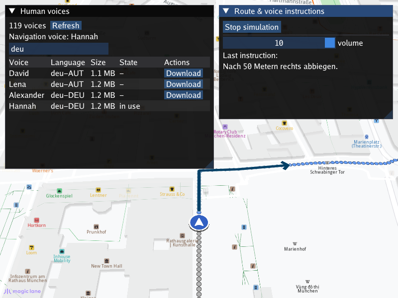

## Overview

This example app demonstrates the following features:
- List the human voices of the MagicLane Online Store, download, pause, resume, cancel and delete them
- Select the downloaded voice used for the navigation voice instructions
- Calculate a route and simulate navigating on it; block the road ahead so the route is recalculated
- Play the voice instructions with a sound player implemented with [miniaudio](https://miniaud.io) (PulseAudio / ALSA on Linux, WASAPI on Windows)

## How to use the sample

1. The `Human voices` window lists the downloaded voices; press `Refresh` to list the voices of the store (type in the filter box, e.g. `deu`,
   `eng-GBR` or `Hannah`). Press `Download` on a voice; if no voice is in use yet, the downloaded voice is selected automatically. Press `Use`
   on any downloaded voice to switch to it and `Delete` to remove it (deleting the voice in use switches to another downloaded voice, if any)
2. In the `Route & voice instructions` window press `Calculate route` and then `Start simulation`: the route in Munich (Haidhausen) has turns,
   a roundabout, a U-turn and two intermediate destinations, and every voice instruction is spoken. The simulation runs at twice the real time
   speed; `Stop simulation` ends it
3. During the simulation `Add roadblock` blocks the next 200 m of the route: the route is recalculated and the instructions of the detour are spoken
4. The volume slider (next to the speaker icon) changes the volume of the next instructions

## How it works

The SDK prepares the voice instructions, the application plays them: on Linux the SDK contains no audio output and no text-to-speech engine.

1. A human voice is a set of pre-recorded phrases. The downloaded voices are listed with `gem::ContentStore().getLocalContentList( gem::CT_HumanVoice )`.
   The store list is requested with `gem::ContentStore().asyncGetStoreContentList( gem::CT_HumanVoice, listener )` (retried while the store answers
   `KBusy`, its rate limit) and read with `gem::ContentStore().getStoreContentList( gem::CT_HumanVoice )`; a voice is downloaded with
   `item.asyncDownload( listener )` (`item.pauseDownload()`, `item.cancelDownload()`, `item.deleteContent()`)
2. The downloaded voice is selected with `gem::SdkSettings().setVoiceByPath( item.getFileName() )`. The selection is not persisted by the SDK: it is done
   at every start
3. `VoiceOutput` creates a sound playing service with `gem::ISdk::Instance()->Produce( service )` and registers the application's sound player,
   `VoicePlayer`, a `gem::ISoundPlayer` implementation, for the MP3 voice instructions with `service->SetPlayer( player, gem::EMimeType::MT_Mp3 )`
4. During the navigation / simulation the SDK calls `gem::INavigationListener::onNavigationSound( sound )`: the application passes the sound to
   `service->Play( sound, &listener, preferences )`, which joins the phrases of the instruction into one MP3 buffer and calls `VoicePlayer::Play()`.
   `canPlayNavigationSound()` returns false while an instruction is being spoken, so the navigation delays the next one.
   `gem::NavigationService().setNavigationRoadBlock( 200 )` blocks the road ahead: the navigation recalculates the route and continues with the new
   instructions. This roadblock is temporary: the SDK removes it when the navigation ends
5. `VoicePlayer::Play()` reads and releases the `gem::ISoundSource`, decodes the MP3 frame by frame (the high level miniaudio decoder would stop
   at the Xing / Info header of the first phrase) and plays it with a miniaudio `ma_sound`
6. The SDK is not thread safe: the sound playing service is called only from the SDK thread. `VoicePlayer::Pump()`, called from the UI callback,
   polls the state of the sounds (`ma_sound_at_end()`) and sends the single `notifyComplete()` expected by the service for every `Play()`
7. At exit the navigation is cancelled; `VoiceOutput` releases the sound playing service before the player (the service keeps a pointer to it)
