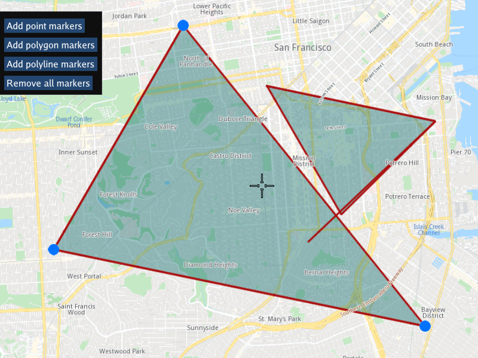

## Overview

This example app demonstrates the following features:
- Show how to add a point or set of points at coordinate(s) of your choice on the interactive map
- Show how to add a line (polyline), or a collection/set of polylines, or a polygon, or a collection of polygons, to the interactive map

## How to use the sample

When the example app is run, the interactive buttons can be clicked to add point, polygon or polyline markers. Each click adds another set of the selected markers.
There is also a button to remove all markers to be able to start over.

## How it works

Latitude, longitude coordinates are defined for each point.
A line consists of 2 or more points - a line with more than 2 points is a polyline, or jointed line.
A polygon consists of 3 or more points, as the simplest polygon is a triangle.

Once the coordinates are defined for the desired points, the set of point markers are rendered using
the point, polyline or polygon type.

1. Create an instance of a `CTouchEventListener` to make the map interactive, enabling touch events such as pan and zoom
2. Create an instance of `MapView` producing an OpenGL context using ImGUI, passing in the touch event listener, and a custom GUI function, `getUiRender`
3. The custom GUI function has a button to add each of: point markers `gem::EMarkerType::MT_Point`, polygon markers `gem::EMarkerType::MT_Polygon` and
   `gem::EMarkerType::MT_Polyline` markers, as well as a button to remove all markers from the map.
4. Depending which button is clicked, `gem::MarkerCollection()` is used to create a collection of the selected type, mentioned above.
5. A single latitude, longitude (in degrees, given as double) coordinate pair is required for each point;
   2 latitude, longitude coordinate pairs are required for each single-segment line, plus 0 or more points for each additional line segment
   on the same line;
   3 latitude, longitude coordinate pairs are required for each polygon, plus 0 or more points if the polygon has more sides than a triangle;
6. The markers are then added to the map using `mapView->preferences().markers().add()`
7. The map is then centered on the area containing all the points of the markers in the set, using `mapView->centerOnArea(col.getArea());` where
   `col` is the marker collection to which the coordinates were added above

