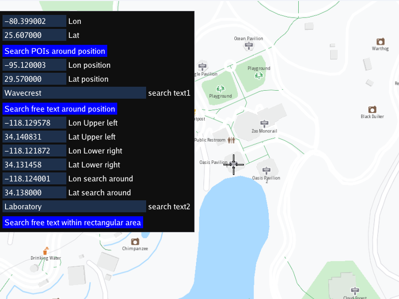

## Overview

This example app demonstrates the following features:
- Shows how to do a search for POIs or text on an interactive movable and zoomable map, around a coordinate or within a bounding box, and centers the search result

## How to use the sample

The example has three buttons:
- to search POIs (points of interest) around a position (preset longitude, latitude - shown but not editable);
- to search free text around a position (preset longitude, latitude and search text - search text is editable);
- to search free text within a rectangular area (preset longitude, latitude for upper left and lower right corners,
  defining the bounding box within which to search, a lon,lat position within the box and search text - search text is editable);

## How it works

The longitude, latitude coordinates of a point or bounding box are defined, and then the searchAroundPosition or search
function is called to carry out the search asynchronously. The app waits for the search to complete, and then centers
the map on the first result (at index 0) if there are any results.

1. Create an instance of a `CTouchEventListener` to make the map interactive, enabling touch events such as pan and zoom
2. Create an instance of `MapView` producing an OpenGL context using ImGUI, passing in the touch event listener, and a custom GUI function, `getUiRender`
3. The custom GUI function has a button to search for any POIs (points of interest) around a position, given as a `gem::Coordinates` containing a
   longitude, latitude coordinate.
   The result is all POIs around that position, and are stored in a `gem::LandmarkList`; the search is carried out using
   `gem::SearchService().searchAroundPosition()` and a `ProgressListener` is used to be notified when the search results have been received
4. If the list of results has 1 or more items in it, that is, it is non-empty, the coordinates of the first result, at index 0, are obtained:
   `results[0].getCoordinates()` and the map is centered on those coordinates: `mapView->centerOnCoordinates()` showing the results using `activateHighlight()`
5. The second button is to search specified text around a position. In addition to the `gem::Coordinates`, the `gem::LandmarkList` to hold the results,
   and the progress listener to be notified when the search is complete, a plain text string is passed in as the search parameter: `gem::SearchService().search()`;
   Again, if the result list is non-empty, the coordinates of the first result, at index 0, are obtained, and the map is centered on those coordinates.
6. The third button is to search text within a rectangular area, or bounding box, specified by longitude, latitude coordinates for the upper left and the
   lower right corners. The bounding box is specified using a `gem::RectangleGeographicArea`, and an empty search preferences instance is also passed in
   using `gem::SearchPreferences()`; a target position within the bounding box is also specified, as for the second button above.
   The search is carried out using `gem::SearchService().search()` and the progress listener notifies when the results have been obtained.
   Again, if the result list is non-empty, the coordinates of the first result, at index 0, are obtained, and the map is centered on those coordinates.

