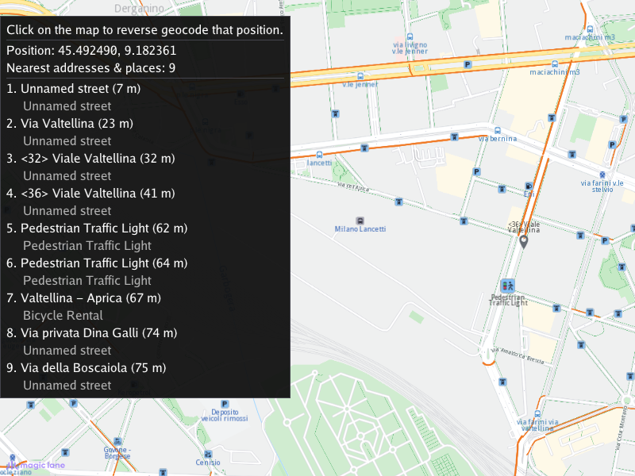

## Overview

This example app demonstrates the following features:
- Show how to perform a reverse geocoding search to find the addresses and points of interest (POIs) nearest to a position picked on the map.

## How to use the sample

When the example app is run, an interactive map is shown together with an instructions panel. Click (or tap) anywhere on the map:
the clicked position is reverse geocoded and the panel lists the nearest addresses and places, each with its name, its distance from
the clicked position, and its description or formatted address. The results are also highlighted on the map. Click somewhere else to
start a new reverse geocoding search; the map can be panned and zoomed as usual.

## How it works

1. Create an instance of `ReverseGeocodingTouchListener`, derived from the standard `CTouchEventListener`, to make the map interactive
   (pan / zoom) and to intercept clicks on the map
2. Create an instance of `MapView` producing an OpenGL context using ImGUI, passing in the touch event listener, and a custom GUI function, `getUiRender`
3. On every clean click (press & release without dragging - dragging only pans the map), the touch listener converts the clicked screen
   position to WGS coordinates using `mapView->transformScreenToWgs()` and starts
   a reverse geocoding search: `gem::SearchService().searchAroundPosition()` called with the clicked `gem::Coordinates`, no text filter, and
   `gem::SearchPreferences` configured to search addresses and map POIs, with at most 10 matches within a 500 m threshold distance;
   the results, closest first, are stored in a `gem::LandmarkList` and a `ProgressListener` is used to detect when the search is complete
4. The search runs asynchronously; the custom GUI function polls the progress listener every frame, so the render loop is never blocked
5. When the search completes, the results are highlighted on the map using `mapView->activateHighlight()`, and the panel lists each result:
   the landmark name, the distance from the clicked position computed with `gem::Coordinates::getDistance()`, and the landmark description,
   falling back to the address formatted with `gem::AddressInfo::format()` when no description is available
