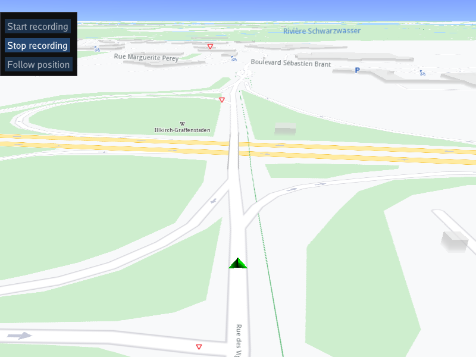

## Overview

This example app demonstrates the following features:
- Save map matched improved positions in GPX format

## How to use the sample

When the example app is run, clicking the Start recording button starts playback of the pre-recorded navigation GPS log in NMEA format,
to simulate an external GPS positions provider, and starts recording. The Stop recording button saves map-matched improved positions in GPX format
to a local file, if the recording is the minimum configured duration (10 seconds in this example) or longer.
If the map is panned during navigation playback, the camera no longer follows the position of the position indicator arrow,
and the Follow position button becomes active, to resume following position when clicked.

## How it works

A pre-recorded NMEA position log of a navigation file is loaded and played back, for the recorder to use as an input source
to record and save a GPX file.

1. Create a custom recorder listener derived from `gem::IProgressListener` to receive GPX export events, such as started, and completed
2. Create an instance of a `CTouchEventListener` to make the map interactive, enabling touch events such as pan and zoom
3. Create an instance of `MapView` producing an OpenGL context using ImGUI, passing in the touch event listener, and a custom GUI function, `getUiRender`
4. The custom GUI function creates the `SDK/Data/Tracks/` and `SDK/Data/Tracks/GPSLogs/` directories, where SDK is the SDK install directory itself;
   the final output `.gpx` files are saved in the Tracks directory, and internal format `.gm` files, used to generate the .gpx files, are in the GPSLogs directory.
   The .gm files may be deleted after the .gpx file is saved.
5. An NMEA data source is created from a pre-recorded navigation, included with this example, using `gem::sense::produceLogDataSource()`
6. A `gem::sense::DataTypeList` is instantiated, and the data types to be recorded are pushed into the list/vector. Note that it is mandatory to add
   `gem::sense::EDataType::Position` because there can be no navigation without this data type. All other data types in the enum are optional.
7. A recorder configuration is instantiated, and the data types configured above are set, like this: `gem::StrongPointerFactory<gem::RecorderConfiguration>()`
8. Note that the `minDurationSeconds` parameter indicates, in this example, that at least 10 seconds of navigation must be recorded in order for the .gpx to be saved
9. A recorder listener is created for exporting the .gpx file, and the Tracks path is passed in like this: `gem::StrongPointerFactory<RecorderListener>()`
10. The recorder is instantiated, passing in the recorder configuration above, using `gem::Recorder::produce()`, and then the recorder listener is added using
    `addListener()`
11. The `gem::ERecorderStatus` enum of the recorder is obtained during operation using `get()->getStatus()` on the recorder from the previous step
12. There is a button to start recording, using `get()->startRecording()` and to stop recording, `get()->startRecording()` on the recorder from step 10
    When recording is stopped, the .gpx file is saved in the Tracks directory

