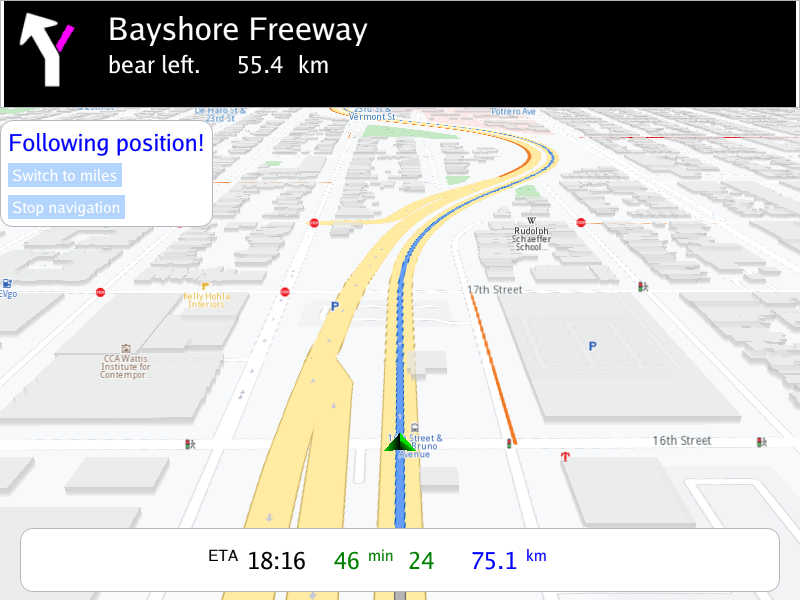

## Overview

This example app demonstrates the following features:
- Calculate a route between two given pairs of coordinates then perform a navigation simulation along the route
- Navigation stats such as next turn icon, instructions and info are displayed in the top panel, as in Magic Earth
- Statistics relating to estimated time of arrival (ETA), remaining time and distance, are displayed in the bottom panel

## How to use the sample

When the example app is run, the scene is viewed from above. When the route calculation is completed a simulation will start.

## How it works

1. Create a custom navigation listener derived from `gem::INavigationListener` to receive navigation events, such as started, waypoint reached, or destination reached
2. Create an instance of a `CTouchEventListener` to make the map interactive, enabling touch events such as pan and zoom
3. Create an instance of `MapView` producing an OpenGL context using ImGUI, passing in the touch event listener, and a custom GUI function, `getUiRender`
4. The custom GUI function has a button to calculate a route; latitude, longitude coordinates for a preset departure position, and a preset destination
   position, are given using a `gem::LandmarkList`, route preferences, such as a route for a car, fastest option, are set using `gem::RoutePreferences()`
   and then a route is calculated using `gem::RoutingService().calculateRoute()`;
   a `ProgressListener` is used to detect when the route calculation is complete, and if the result, stored using a `gem::RouteList`,
   contains at least one route, the first route, at index 0, is added to the map to be rendered, using `mapView->preferences().routes().add()`
5. Simulated navigation is started along the route using `gem::NavigationService().startSimulation()`
6. The camera is set to follow the position indicator arrow using `mapView->startFollowingPosition();`
7. There is also a follow position button, to resume following the position indicator along the route, if the map is panned, which causes an exit from
   follow position mode; this is resumed using `mapView->startFollowingPosition();`
8. There is a button to toggle display of units between miles/km
9. This app is organized to look like Magic Earth, so it has a top and a bottom navigation panel, to display navigation statistics.
   The next turn icon image is obtained using `navinstruct.getNextTurnDetails().getAbstractGeometryImage().render()` where navinstruct is the
   navigation instruction, `gem::NavigationService().getNavigationInstruction()`; the icon image is loaded as a texture into the GPU using
   `BitmapImpl::LoadTextureIntoGPU()` and then the texture id is passed to `ImGui::Image()` to render it as an image.
10. The corresponding text instruction for the next turn is obtained using `navinstruct.getNextTurnInstruction()` and also displayed;
    the other statistics, such as street name, time and distance to next turn are obtained from the navigation instruction in a similar fashion,
    as seen in the example. More statistics are available, as listed in the `GEM_NavigationInstruction.h` header.

