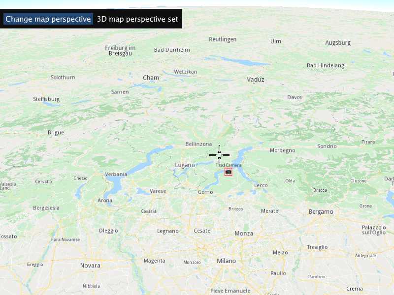

## Overview

This example app demonstrates the following features:
- Show how to change the map perspective between 2D and 3D views.

## How to use the sample

When the example app is run, the scene is viewed from above. The button toggles the map view perspective mode between 2D (looking vertically downward) and 3D (looking toward horizon).

## How it works

1. Create an instance of a `CTouchEventListener` to make the map interactive, enabling touch events such as pan and zoom
2. Create an instance of `MapView` producing an OpenGL context using ImGUI, passing in the touch event listener, and a custom GUI function, `getUiRender`
3. The custom GUI function has a button to change the map perspective; the state is kept internally as a static bool flag, and the button toggles between
   3D perspective (looking at the map toward the horizon) `gem::MVP_3D` and
   2D perspective (looking vertically downward/perpendicular directly at the map) `gem::MVP_2D` at each click;
   the map perspective is set using `mapView->preferences().setMapViewPerspective()` and an optional animation in milliseconds is specified (2000 = 2 seconds).

