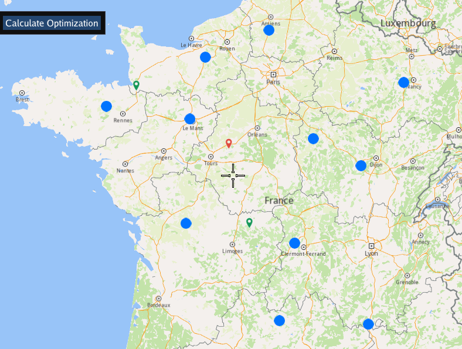
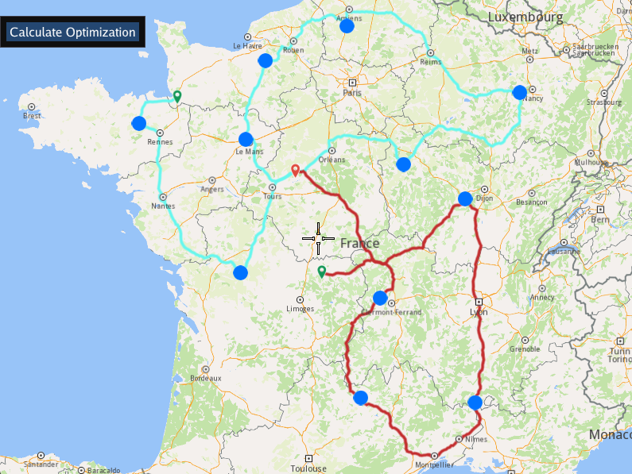

## Overview

This example app demonstrates the following features:
- Add an optimization with custom configuration parameters, orders with different fields set, multiple vehicles with different constraints set; display the solution on the map.

## How to use the sample

When you run the example app, an optimization will be saved, the solution will be returned and showed on map.

## How it works

1. Create a `vrp::OrderList` and add the orders to it. Each order needs to have a customer set; you can either add a new customer and then set it to the order, or you can use a previously created customer (see [Get Customer](../GetCustomer) example)
2. Create a `vrp::ConfigurationParameters` and set the desired parameters.
3. Create one `vrp::VehicleConstraints` for each vehicle and set them to a `vrp::VehicleConstraintsList`.
4. Create a `vrp::Optimization`, set the desired fields and the objects created at 1.), 2.) and 3.) to it.
5. Create a `ProgressListener`, `vrp::Service`,  and a `vrp::Request` that will be used for traking the request status.
6. Call the `addOptimization()` method from `vrp::Service` using the list from 5.), the `vrp::Optimization` from 4.) and the progress listener.
7. After adding an optimization, check whether the associated request has reached the finished status. Once completed, you can retrieve the optimization results by calling the `getSolution()` method, which returns a `vrp::RouteList` containing the generated routes.
8. Display orders and routes on the map.

