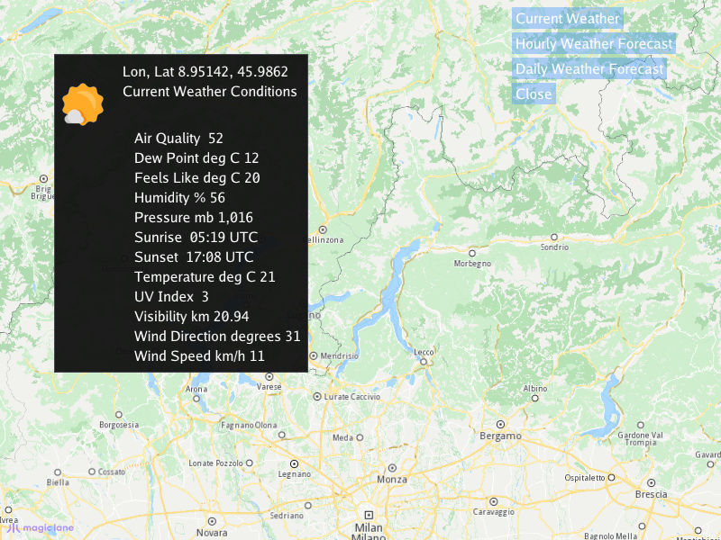

## Overview

This example app demonstrates the following features:
- Retrieve current weather, hourly forecasts, and daily forecasts for any map location
- Display weather data and icons in an interactive UI panel

## How to use the sample

When the example app is run, an interactive map is shown with an instructions panel. Click (or tap) on the map to
select a location: the current weather conditions, a 36-hour hourly forecast and a 10-day daily forecast are fetched
for that position, and a menu appears with buttons to choose which of the three to display in the panel, together
with a weather condition icon. Dragging only pans the map - the selected location is not changed; a new clean click
selects a new location. The `Close` button hides the menu and the panel; clicking the map again brings them back.

## How it works

1. A custom touch event listener derived from `CTouchEventListener` intercepts the map clicks. A click is distinguished
   from a map pan: only a press & release without significant movement selects a location.
2. On a clean click, the screen position is converted to WGS coordinates using `mapView->transformScreenToWgs()`.
3. The weather data for the clicked position is requested with `gem::weather::Service()`: `getCurrent()` for the current
   conditions, `getHourlyForecast()` (36 hours) and `getDailyForecast()` (10 days), each with its own `ProgressListener`;
   the code waits for each request and validates the result (listener error, non-empty forecast) before using it.
4. The received condition parameters (name, unit, value) are formatted into display strings, and the condition icon
   (`gem::Image`) is kept for each forecast type.
5. The custom GUI function, `getUiRender`, renders a menu with a button per forecast type and a `Close` button, and a
   panel showing the stored strings for the selected type in a table, with the condition icon rendered via
   `image.render()` into a bitmap that is loaded as a GPU texture and drawn with `ImGui::Image()`.
6. The touch listener is deliberately a local in `main()` declared after the `SdkSession`, so its SDK objects (map view
   reference, weather icon images) are released before the SDK shuts down.
