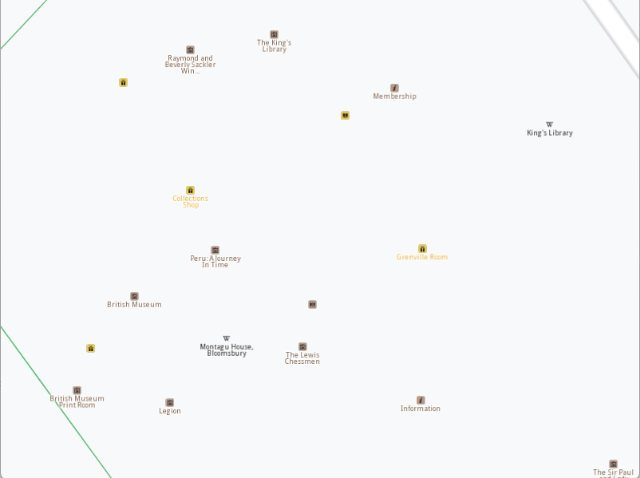

## Overview

This example app demonstrates the following features:
- Print the Wikipedia title and description once a landmark with Wikipedia info is being long pressed.

## How to use the sample

When you run the example app, you'll be viewing the scene from above. The map view will center over an area with landmarks that have Wikipedia info.
Click and hold the left mouse button (or long tap) on top of one such landmark. Its Wikipedia info will be printed to log once fetched.

## How it works

1. A `IMapViewListener` is implemented which handles the `onLongDown` event.
2. A `MapView` is produced and the listener from 1 is passed.
3. The `MapView` centers on a location where landmakrs with Wikipedia info are located.
4. The user must long left click on a landmark which has Wikipedia info. `onLongDown` event from #1 will get called.
5. We iterate the `cursorSelectionLandmarks` and fetch the Wikipedia info for the first landmark. We use a custom implementation of progress listener that packs fetching of Wikipedia info inside it.
6. When the progress listener `notifyComplete` call is received, the Wikipedia title and description is printed.
