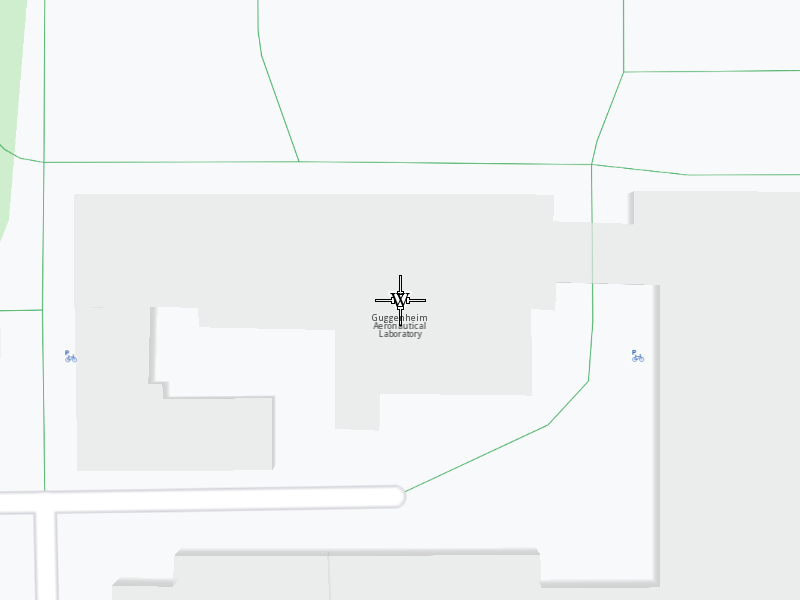

# Search free text in geographic area

Search for places using text. Obtain the results that fall in the given geographic area.

## Use case

Search for points of interest relevant to the given input text. Filter the results by a geographic area.

## How to use the sample

When you run the example app, you'll be viewing the scene from above. A fly will be performed to the first point of interest found.

## How it works

1. Create a `MapServiceListener`, `OpenGLContext`, `Screen` and `MapView`.
2. Create a `LandmarkList`.
3. Create a geographic area of choice.
4. Call the `SearchService` using the list from 2.) a progress listener, the keywords you are searching for, a pair of coordinates relevant to your search and the geographic area from 3.).
5. Once the search operation completes, instruct the `MapView` to center on the coordinates of the first result.
6. Instruct the `MapView` to activate the highlight in order for the result to be seen better.
