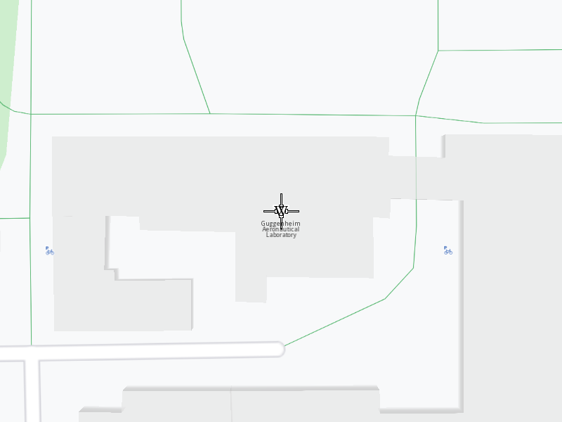

# Search free text in geographic area

Search for places using text. Obtain the results that fall in the given geographic area.

## Use case

Search for points of interest relevant to the given input text. Filter the results by a geographic area.

## How to use the sample

When you run the example app, you'll be viewing the scene from above. The map centers on the search-limit
geographic area, which is drawn as a rectangle outline on the map, so you can see that only the results
inside it are highlighted.

## How it works

1. Create a `MapServiceListener`, `OpenGLContext`, `Screen` and `MapView`.
2. Create a `LandmarkList`.
3. Create a geographic area of choice (a `gem::RectangleGeographicArea` in this example).
4. Call the `SearchService` using the list from 2.) a progress listener, the keywords you are searching for, a pair of coordinates relevant to your search and the geographic area from 3.).
5. The geographic area is rendered on the map as an unfilled rectangle outline: a `gem::MarkerCollection` of type
   `gem::EMarkerType::MT_Polyline` containing a single `gem::Marker` with the area's 4 corners (closed by repeating
   the first corner), styled via `gem::MarkerCollectionRenderSettings` (polyline inner color / size) and added with
   `mapView->preferences().markers().add()`.
6. Once the search operation completes, instruct the `MapView` to center on the search-limit area using
   `centerOnArea()` (automatic zoom, so the whole rectangle is visible).
7. Instruct the `MapView` to activate the highlight in order for the results to be seen better - all highlighted
   results fall inside the rendered rectangle.
