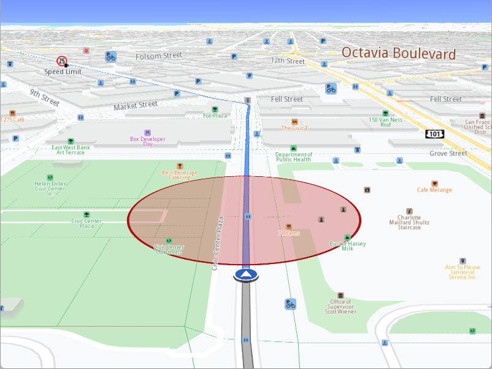

## Overview

This example app demonstrates the following features:
- Print a message when a monitored area is being entered or exited.

## How to use the sample

When you run the example app, you'll be viewing the scene from above. When the route calculation is completed a simulation will start. In a few seconds the GPS position will reach inside a monitored red circle area.

## How it works

1. Create a `MapViewListener`, `OpenGLContext`, `Screen` and `MapView`.
2. Create an `AlarmService`, a `CircleGeographicArea`, instruct the `AlarmService` to monitor the `CircleGeographicArea`.
3. Create a `MarkerCollection`, a `Marker` from the `CircleGeographicArea`. Add the newly created `Marker` to the `MarkerCollection`. Add the `MarkerCollection` to `MapViewPreferences::markers()`. 
	This causes the circle to be rendered on the map.
4. Create a `RouteList`, a `LandmarkList` with two Landmarks in it and a `RoutePreferences` object.
5. Call the `RoutingService` using `RouteList`, `LandmarkList`, `RoutePreferences` and the progress listener.
6. Once the route calculation operation completes, add the first calculated route to the `MapViewPreferences` routes collection.
7. Create a `ProgressListener` and a `NavigationListener`. Instruct the `NavigationService` to start a simulation using the first route and the newly created listeners.
8. Instruct the `MapView` to start following the position.
