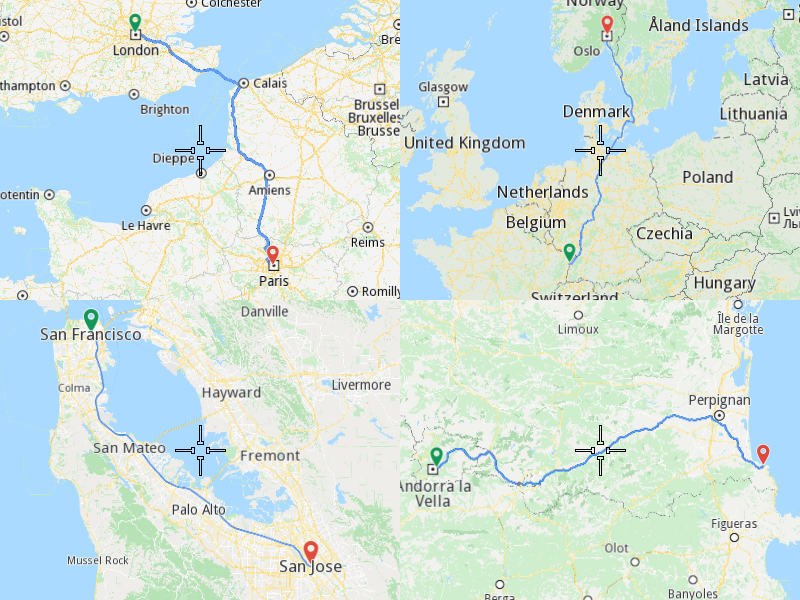

## Overview

This example app demonstrates the following features:
- Calculate routes and display them in separate views

## How to use the sample

When you run the example app, you'll be viewing the scene from above. The screen will be split into two identical views. From each view a fly will be performed to a different calculated route.

## How it works

1. Create two `MapServiceListener` objects, one `OpenGLContext`, one `Screen` and two `MapView` objects.
2. Create a `RouteList`, a `LandmarkList` with two Landmarks in it and a `RoutePreferences` object.
3. Call the `RoutingService` using `RouteList`, `LandmarkList`, `RoutePreferences` and the progress listener.
4. Perform steps 2 and 3 for the 2nd `MapView`.
5. Once the route calculation operations complete, add the first calculated route of each collection to their corresponding view `MapViewPreferences` routes collection.
6. Instruct both the `MapView` objects to center on the first route.
