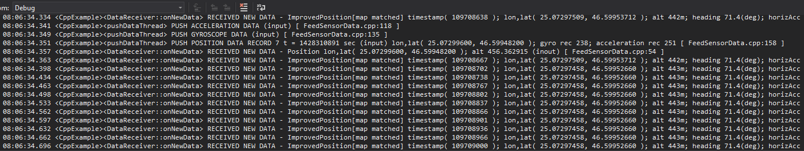

## Overview

This example app demonstrates the following features:
- Show how to feed SDK with acceleration, gyroscope and position sensors data.

## How to use the sample

When you run the example app, map matched improved position will be logged on console.

## How it works

1. Define a custom `DataSourceListener` class to enable receiving processed data from the SDK.
2. Create a list of the sensor data types that will be input into the SDK.
3. Create an external data source to input the above data types into the SDK.
4. Add a listener for the data type(s) desired to be received back from the SDK.
5. Start the data source.
6. Push / feed / input one position / second to the SDK, along with all other sensor measurements during that second.
