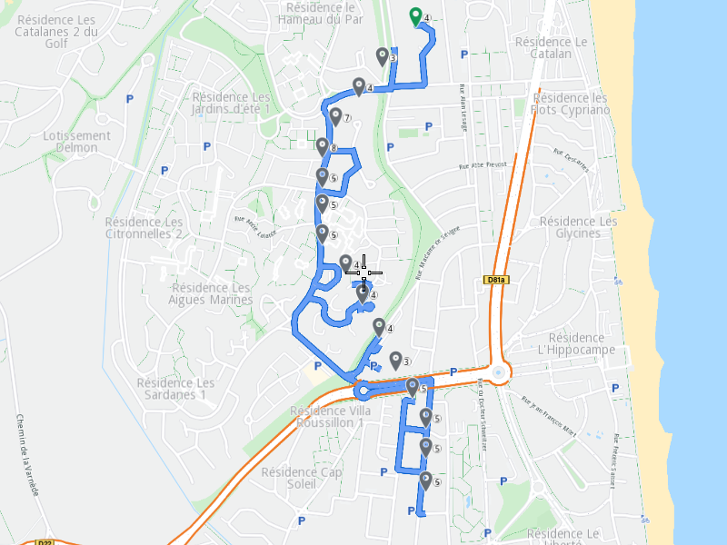

## Overview

This example app demonstrates the following features:
- Calculate a route by drawing with the finger or mouse on the map.

## How to use the sample

When you run the example app, you'll be viewing the scene from above. The map is fully interactive, and supports pan and zoom.

Double-click once to activate draw mode, then click and drag a route from one point to another on the map, and when the finger is lifted/mouse button is released, the route is generated using the waypoints along the traced route.

Double-click twice to activate draw mode, then click and drag a route from one point to another on the map, and when the finger is lifted/mouse button is released, the route is generated using only the initial and final waypoint from the traced route, thus the route will be the most efficient between the starting/departure position and destination, with no intermediate waypoints.

## How it works

1. Create a `MapServiceListener`, `OpenGLContext`, `Screen` and `MapView`.
2. Create a `RouteList`, a `LandmarkList` with two Landmarks in it and a `RoutePreferences` object.
3. Call the `RoutingService` using `RouteList`, `LandmarkList`, `RoutePreferences` and the progress listener.
4. Once the route calculation operation completes, add the first calculated route to the `MapViewPreferences` routes collection.
5. Instruct the `MapView` to center on the first route.
