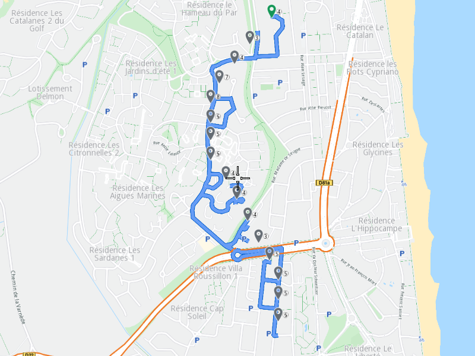

## Overview

This example app demonstrates the following features:
- Calculate a route by drawing with the finger or mouse on the map.

## How to use the sample

When you run the example app, you'll be viewing the scene from above. The map is fully interactive, and supports pan and zoom.

Double-click once to activate draw mode, then click and drag a route from one point to another on the map, and when the finger is lifted/mouse button is released, the route is generated using the waypoints along the traced route.

Double-click twice to activate draw mode, then click and drag a route from one point to another on the map, and when the finger is lifted/mouse button is released, the route is generated using only the initial and final waypoint from the traced route, thus the route will be the most efficient between the starting/departure position and destination, with no intermediate waypoints.

## How it works

1. Create a custom touch event listener derived from `CTouchEventListener` which intercepts the touch events, and a `MapView` with it.
2. A double click (or two double clicks) arms draw mode: while it is armed, the map's normal pan gesture is suppressed and the touch events are
   used for drawing instead.
3. While the finger / mouse button is down, each move event's screen position is converted to WGS coordinates using `mapView->transformScreenToWgs()`
   and appended as a `gem::Landmark` waypoint (skipping consecutive identical positions). In the two-waypoint mode (armed with two double clicks)
   only the first position and the release position are kept.
4. When the finger is lifted / the mouse button is released, the collected waypoints are used to calculate a route with
   `gem::RoutingService().calculateRoute()`, and a `ProgressListener` is used to detect when the calculation is complete.
5. If a route results, it is added to the map with `mapView->preferences().routes().add()` and the map centers on it using `mapView->centerOnRoute()`.
