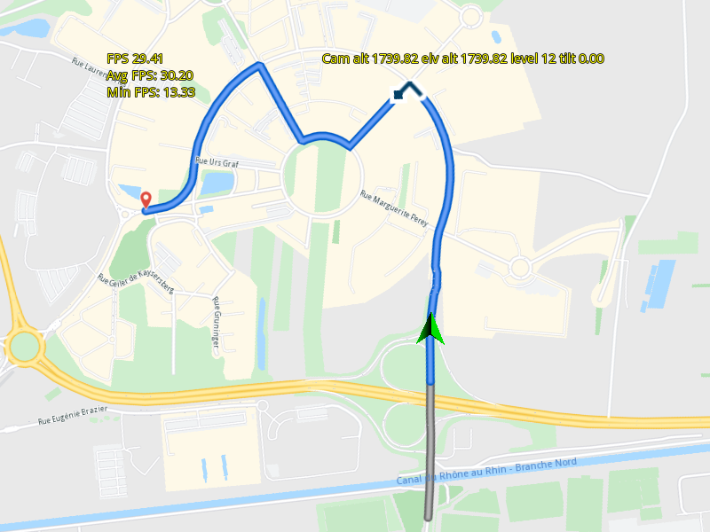

## Overview

This example app demonstrates the following features:
- Configure SDK for low-end devices and start a navigation based on NMEA file.

## How to use the sample

When you run the example app, a playback of a pre-recorded navigation will start automatically,
using settings and a map style for low-end CPU hardware.

## How it works

SDK settings specific for low-end CPU hardware are set, to demonstrate them, as well as a corresponding map style.
These settings are to demonstrate the SDK on low-end CPU hardware, but are not mandatory for navigation, simulation or
pre-recorded navigation playback.

Next, a GPX file is loaded, and the waypoints are used to calculate and render a route.
A corresponding NMEA pre-recorded navigation, matching that route, is set as a datasource, and played back,
thus simulating navigation using the pre-recorded NMEA-format position data.

