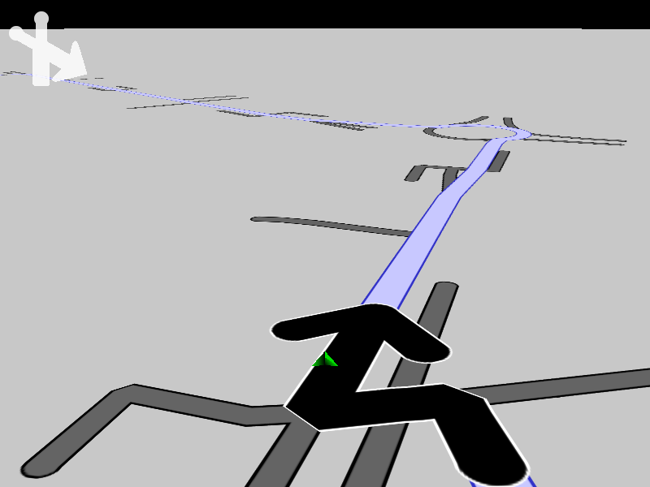

## Overview

This example app demonstrates the following features:
- Add markers collection from route packed geometry
- Add markers collection from route instruction packed geometry
   

## How to use the sample

When you run the example app, route packed geometry, route instructions, pre-recorded positions and a map style
will be extracted from data.zip and will be used to simulate a navigation.

## How it works

A custom listener, which implements the navigation, position and mapview listeners, is instantiated,
and extracts the data.zip archive included with this example. The archive contains a route,
route instructions, a pre-recorded navigation in NMEA format, and a map style.

The route is rendered, and the pre-recorded navigation (positions) in NMEA format,
corresponding to the route, is played back, along with the corresponding turn-by-turn
instruction images, rendered in the upper left corner of the viewport.

