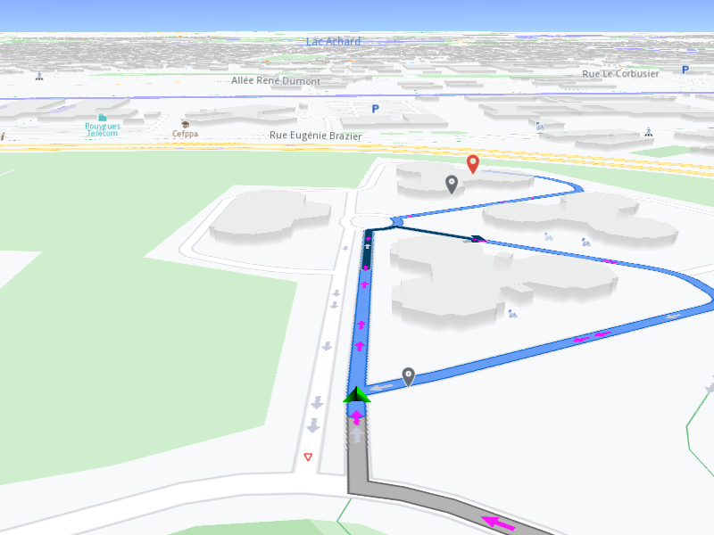

## Overview

This example app demonstrates the following features:
- Set a map style containing the Route Direction Arrows layer.

## How to use the sample

When you run the example app, a map style containing the Route Direction Arrows layer will be activated and rendered in a simulated navigation.

## How it works
