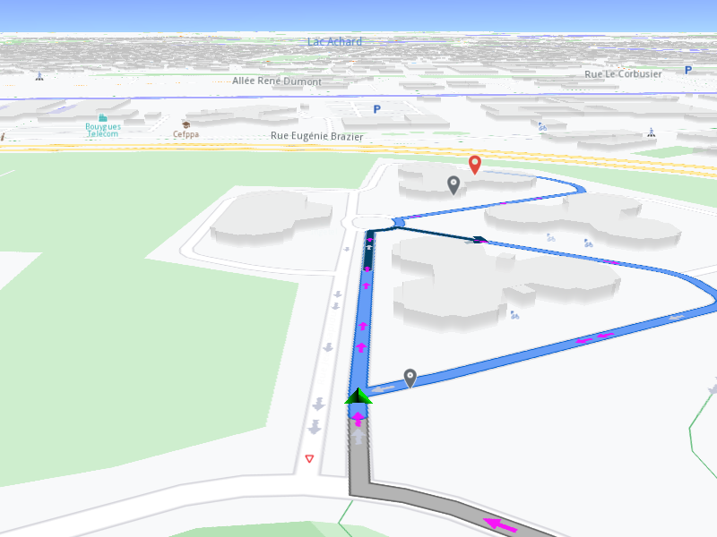

## Overview

This example app demonstrates the following features:
- Set a map style containing the Route Direction Arrows layer.

## How to use the sample

When you run the example app, a map style containing the Route Direction Arrows layer will be activated and rendered in a simulated navigation.

## How it works

A mobile map style which includes the Route Direction Arrows layer (added in Selected Layers -> Roads arrows in the
online map studio before saving the style) is bundled with the example.

1. Create an instance of a `CTouchEventListener` to make the map interactive, and a `MapView`.
2. The bundled style is copied to the cache and activated by local file path using `mapView->preferences().setMapStyleByPath()`.
3. The direction arrow colors are overridden with `gem::RouteRenderSettings` - `setDirectionArrowInnerColor()` /
   `setDirectionArrowOuterColor()` - and arrow rendering is activated with the `gem::ERouteRenderOptions::RRS_ShowDirectionArrows` option.
4. A route is calculated over preset waypoints using `gem::RoutingService().calculateRoute()`, added to the map with the render settings
   from 3.), and a simulated navigation is started along it using `gem::NavigationService().startSimulation()`, so the arrows can be seen
   during navigation.
