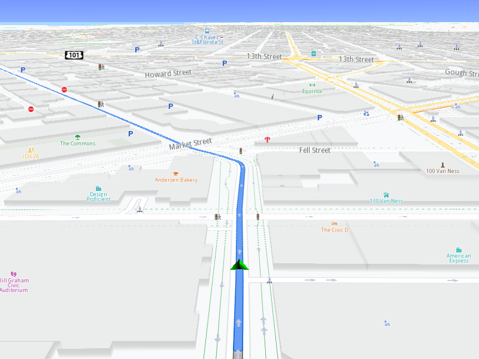

## Overview

This example app demonstrates the following features:
- Calculate a route and simulate navigating on it.

## How to use the sample

When you run the example app, you'll be viewing the scene from above. When the route calculation is completed a simulation will start.

## How it works

1. Create a `MapServiceListener`, `OpenGLContext`, `Screen` and `MapView`.
2. Create a `RouteList`, a `LandmarkList` with two Landmarks in it and a `RoutePreferences` object.
3. Call the `RoutingService` using `RouteList`, `LandmarkList`, `RoutePreferences` and the progress listener.
4. Once the route calculation operation completes, add the first calculated route to the `MapViewPreferences` routes collection.
5. Create a `ProgressListener` and a `NavigationListener`. Instruct the `NavigationService` to start a simulation using the first route and the newly created listeners.
6. Instruct the `MapView` to start following the position.
