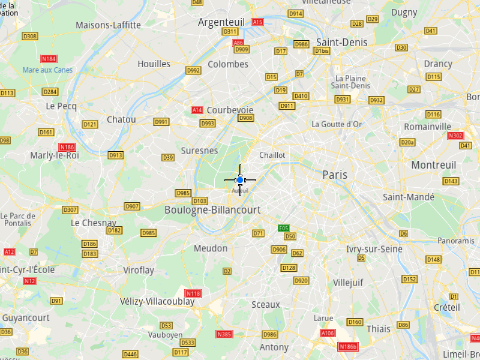

## Overview

This example app demonstrates the following features:
- Add a customer to the agenda to create orders for this customer and to use them in optimizations.

## How to use the sample

When you run the example app, a customer will be saved.

## How it works

1. Create a `vrp::Customer` and set the desired fields.
2. Create a `ProgressListener` and `vrp::Service`.
3. Call the `addCustomer()` method from the `vrp::Service` using the `vrp::Customer` and `ProgressListener` and wait for the operation to be done.

### To display the customer

1. Create a `Landmark` and add it to a `LandmarkList`.
2. Create a `MapServiceListener`, `OpenGLContext` and `MapView`.
3. Instruct the `MapView` to highlight the `LandmarkList` from 1.).
4. Instruct the `MapView` to center on the customer's coordinates.
5. Allow the application to run until the map view is fully loaded.
