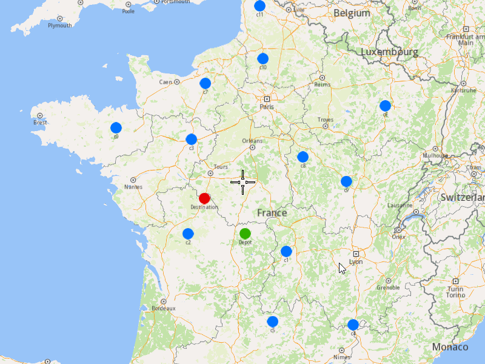
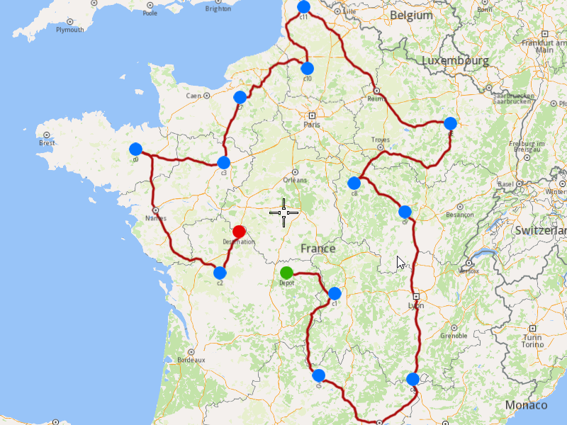

## Overview

This example app demonstrates the following features:
- Add an optimization with a single vehicle with different departure and destination locations and display the solution on the map.

In this optimization the orders are visited using only one vehicle which starts its route at one location and ends it at another location.

## How to use the sample

When you run the example app, an optimization will be saved, the solution will be returned and showed on map.

## How it works

1. Create a `vrp::OrderList` and add the orders to it. Each order needs to have a customer set; you can either add a new customer and then set it to the order, or you can use a previously created customer (see [Get Customer](../GetCustomer) example).
2. Create a `vrp::ConfigurationParameters` and set the route type to be `RT_CustomEnd`.
3. Create a `vrp::Optimization` and set the objects created at 1.) and 2.) to it. Also set the departure from which the vehicle will start its route and the destination where it will end the route.
4. Create a `ProgressListener`, `vrp::Service`, and a `vrp::Request` that will be used for tracking the request status.
5. Call the `addOptimization()` method from `vrp::Service` using the request from 4.), the `vrp::Optimization` from 3.), and the progress listener.
6. After adding the optimization, monitor the status of the associated request. Once it reaches a finished state, retrieve the optimization results by calling the `getSolution()` method, which returns a `vrp::RouteList` containing the generated routes.

### To display the orders and routes on the map

1. Create a `MapServiceListener`, `OpenGLContext` and `MapView`.
2. Create a `LandmarkList`, `CoordinatesList` and `PolygonGeographicArea`.
3. Instruct the `MapView` to highlight the `LandmarkList` from 2.) to print the orders, departures and destinations.
4. Instruct the `MapView` to center on the `PolygonGeographicArea`.
5. Create a `MarkerCollection` of type `Polyline` and add the route's shape to it.
6. Set the newly created `MarkerCollection` in the markers collections of the map view preferences.
7. Allow the application to run until the map view is fully loaded.
