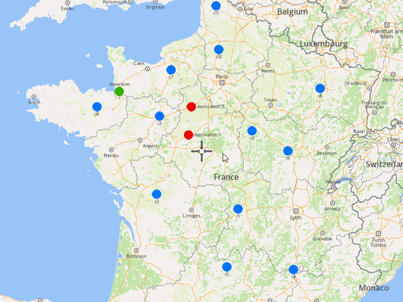
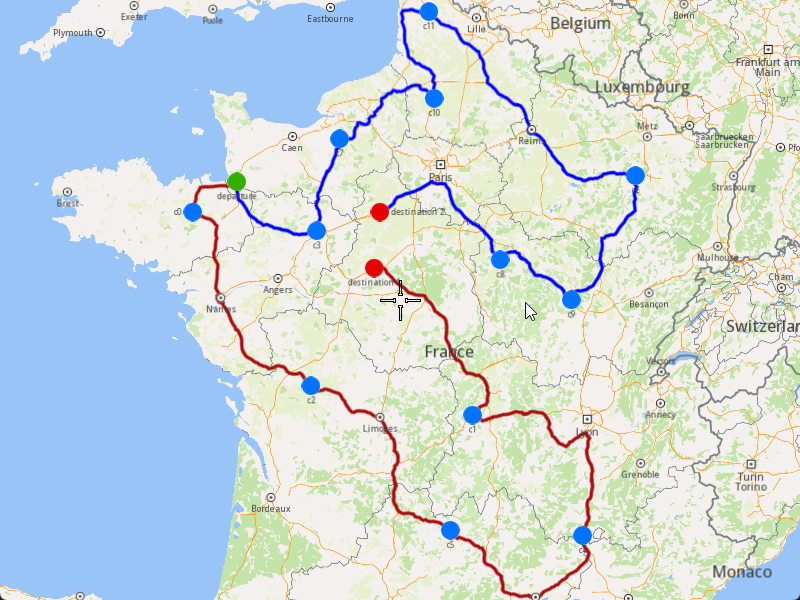

## Overview

This example app demonstrates the following features:
- Add an optimization with multiple vehicles which end their routes at different destinations and display the solution on the map.

## How to use the sample

When you run the example app, an optimization will be saved, the solution will be returned and showed on map.

## How it works

1. Create a `vrp::OrderList` and add the orders to it. Each order needs to have a customer set; you can either add a new customer and then set it to the order, or you can use a previously created customer (see [Get Customer](../GetCustomer) example).
2. Create a `vrp::ConfigurationParameters` and set the route type to be `RT_CustomEnd`.
3. Create a `vrp::VehicleConstraints` with the desired fields and add it to a `vrp::VehicleConstraintsList`. The `vrp::VehicleConstraints` will be applied to all the vehicles.
4. Create a `vrp::Optimization` and set the objects created at 1.), 2.), and 3.) to it. Also set other parameters such as destinations.
5. Create a `ProgressListener`, `vrp::Service`, and a `vrp::Request` that will be used to track the request status.
6. Call the `addOptimization()` method from `vrp::Service` using the request from 5.), the `vrp::Optimization` from 4.), and the progress listener.
7. After adding the optimization, monitor the status of the request. Once it reaches a finished state, retrieve the optimization results by calling the `getSolution()` method, which returns a `vrp::RouteList` containing the generated routes.

### To display the orders and routes on the map

1. Create a `MapServiceListener`, `OpenGLContext` and `MapView`.
2. Create a `LandmarkList`, `CoordinatesList` and `PolygonGeographicArea`.
3. Instruct the `MapView` to highlight the `LandmarkList` from 2.) to print the orders, departures and destinations.
4. Instruct the `MapView` to center on the `PolygonGeographicArea`.
5. Create a `MarkerCollection` of type `Polyline` for each route and add the routes shapes to them.
6. Set the newly created `MarkerCollection` in the markers collections of the map view preferences.
7. Allow the application to run until the map view is fully loaded.
