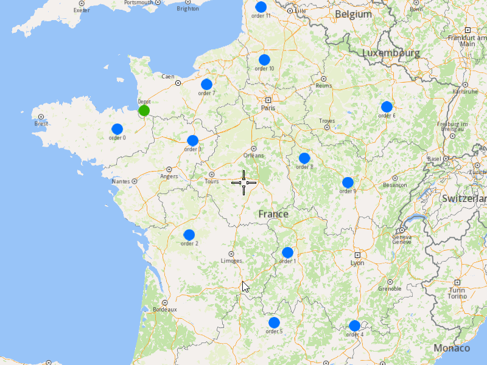
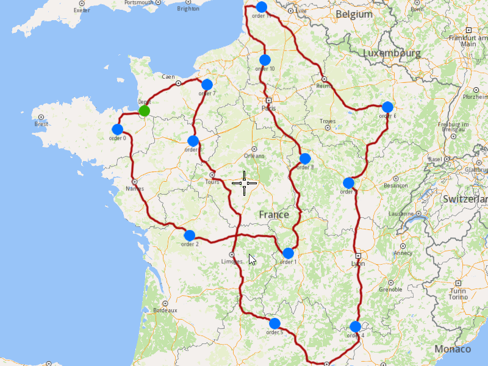

## Overview

This example app demonstrates the following features:
- Add an optimization with orders that have all the fields set and display the solution on the map.

Create an optimization where for each order can be set:
  - the descriptive fields:
    - name
	- address
	- email
	- phone number
  - the restrictive fields:
    - the type: pick up or delivery
	- the number of pieces, weight, and cube that have to be picked-up from it or delivered at it
	- the service time: how much time does the vehicle stay at this order to do its job (ex: to unload the pieces)
	- the time window within which the order must be visited
	- the revenue which has to be received from this order

## How to use the sample

When you run the example app, an optimization will be saved, the solution will be returned and showed on map.

## How it works

1. Create a `vrp::Order` for each order that has to be visited, set its fields, and then add it into a `vrp::OrderList`.
2. Create a `vrp::Optimization` and set the list created at 1.) to it.
3. Create a `ProgressListener`, `vrp::Service`, and a `vrp::Request` that will be used to track the request status.
4. Call the `addOptimization()` method from `vrp::Service` using the request from 3.), the `vrp::Optimization` from 2.), and the progress listener.
5. After adding the optimization, monitor the request until it reaches a finished state. Once completed, retrieve the optimization results by calling the `getSolution()` method, which returns a `vrp::RouteList` containing the generated routes.

### To display the orders and routes on the map

1. Create a `MapServiceListener`, `OpenGLContext` and `MapView`.
2. Create a `LandmarkList`, `CoordinatesList` and `PolygonGeographicArea`.
3. Instruct the `MapView` to highlight the `LandmarkList` from 2.) to print the orders, departures and destinations.
4. Instruct the `MapView` to center on the `PolygonGeographicArea`.
5. Create a `MarkerCollection` of type `Polyline` and add the route's shape to it.
6. Set the newly created `MarkerCollection` in the markers collections of the map view preferences.
7. Allow the application to run until the map view is fully loaded.
