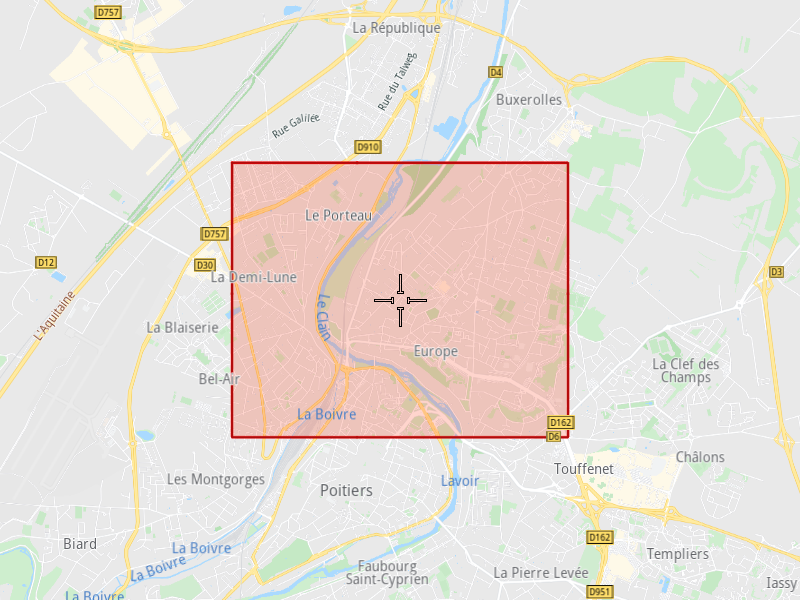

## Overview

This example app demonstrates the following features:
- Add a rectangle territory.

## How to use the sample

When you run the example app, a rectangle territory will be saved.

## How it works

1. Create a `vrp::Territory` and set the name, type (`Rectangle`), color and data. The data must contain 2 diagonally opposite coordinates.
2. Create a `ProgressListener` and `vrp::Service`.
3. Call the `addTerritory()` method from the `vrp::Service` using the `vrp::Territory` and `ProgressListener` and wait for the operation to be done.

### To display the territory

1. Create a `CoordinatesList` and add the territory's coordinates to it.
2. Create a `MapServiceListener`, `OpenGLContext` and `MapView`.
3. Create a `MarkerCollection` of type Polygon and add the list created at 1.) to it.
4. Create a `MarkerCollectionDisplaySettings` and set the territory's color to the polygon fill color.
5. Set the newly created `MarkerCollection` in the markers collections of the map view preferences, together with the `MarkerCollectionDisplaySettings`.
6. Allow the application to run until the map view is fully loaded.
