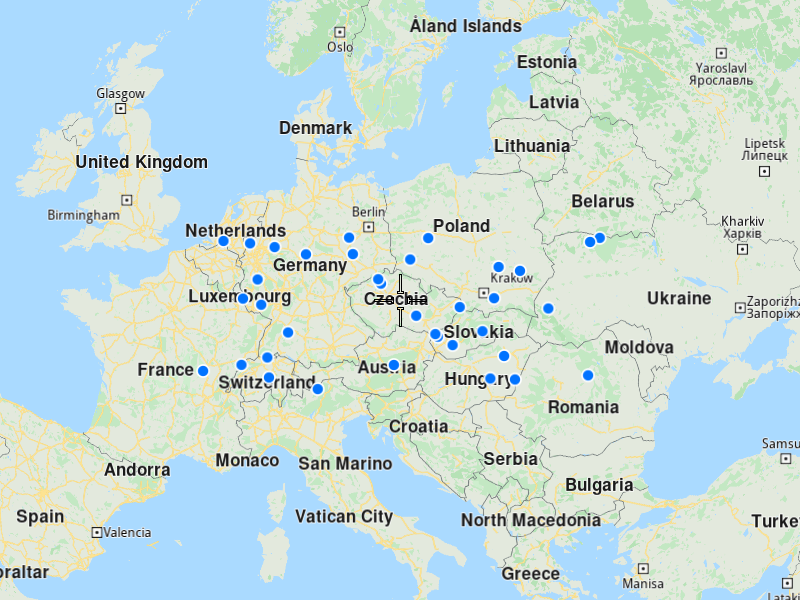
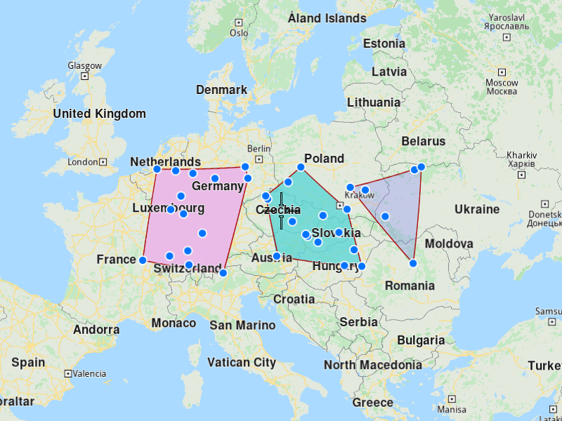

## Overview

This example app demonstrates the following features:
- Generate a number of polygon territories from a list of coordinates and display them on the map.

To generate one territory, minimum 3 coordinates are needed; remember that the number of coordinates should be at least 3 times the number of territories that you want to create.
If the number of territories to be created is not specified, the algorithm will determinate how many should be created.

When having many locations to visit, it is better if first you divide them by territories and after you can create optimizations with the customers from each territory.

## How to use the sample

When you run the example app, a list of territories will be returned and showed on map.

## How it works

1. Create a `CoordinatesList` and add all the `Coordinates`.
2. Create a `ProgressListener`, `vrp::Service` and `vrp::Territorylist`, in which the territories will be returned.
3. Call the `generateTerritories()` method from `vrp::Service` using the lists from 2.) and 1., specify the number of territories that you want to create and the progress listener.
4. Once the operation completes, the list from 2.) will contain the generated territories.

### To display the locations and territories on the map

1. Create a `MapServiceListener`, `OpenGLContext` and `MapView`.
2. Create a `MarkerCollection` of type Point and add  `CoordinatesList` from above.
3. Create a `MarkerCollectionDisplaySettings` and set the `pointsGroupingZoomLevel` to `0`, to not group the points on the map.
4. Set the newly created `MarkerCollection` in the markers collections of the map view preferences, together with the `MarkerCollectionDisplaySettings`.
5. Instruct the `MapView` to center on the `MarkerCollection`'s area.
6. For each territory create a `MarkerCollection` and a `MarkerCollectionDisplaySettings`. In the `MarkerCollection` add the data of the territory and in the `MarkerCollectionDisplaySettings` set the territory's color to the `polygonFillColor`.
7. Set the all the newly created `MarkerCollection` in the markers collections of the map view preferences, together with the `MarkerCollectionDisplaySettings`.
8. Allow the application to run until the map view is fully loaded.
