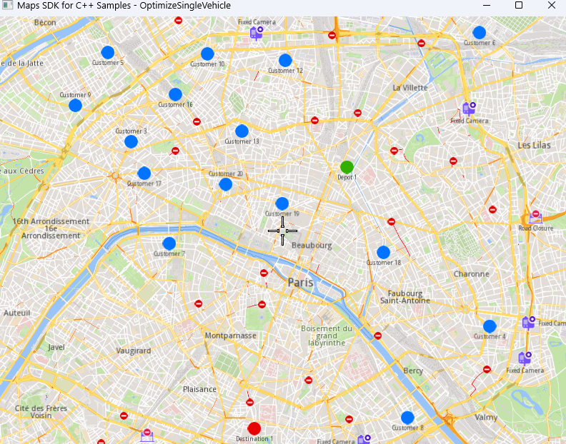
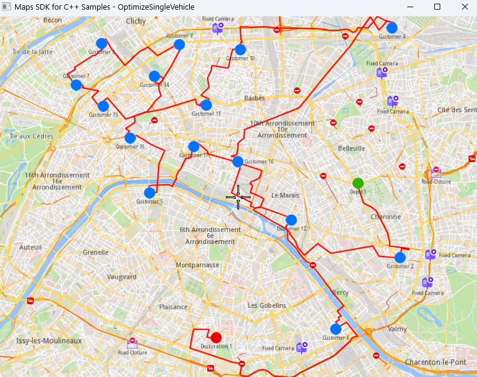

## Overview

This example app demonstrates the following features:
- Perform a stateless optimization using a single JSON input that contains all the configuration parameters, orders, vehicles, and constraints for a single vehicle with 17 orders.
- Retrieve and display the solution on the map.

## How to use the sample

When you run the example app, an optimization will be performed based on the JSON input.
The solution will be retrieved and displayed on the map once the optimization is finished.

## How it works

1. Create a JSON object containing all the optimization data:
   - **Configuration parameters** (optimization criteria, route type, time windows, etc.)
   - **Orders** (pickup and delivery points with location, weight, cube, time windows, and service time)
   - **Vehicles** (capacity, start and end times, consumption, and identifiers)
   - **Departures and destinations** (depots and end points)
   - **Vehicle constraints** (optional operational limits such as maximum distance or revenue)

2. Create a `ProgressListener` and a `vrp::Service`.

3. Call the `optimize()` method from `vrp::Service` using the JSON input and a `vrp::Request` object that will be used for tracking the request status.

4. Wait until the optimization request reaches the finished status.

5. Retrieve the optimization results in JSON format by calling the `getSolutionJson()` method, which returns the solution containing the optimized routes.

### To display the orders and routes on the map

1. Create a `MapViewListener`, an `OpenGLContext`, and a `MapView`.
2. Parse the JSON input to extract the orders, departures, and destinations.
3. Create a `LandmarkList` and a `CoordinatesList` using the parsed data.
4. Display the landmarks on the map and center the view around them.
5. Parse the JSON output containing the optimized routes.
6. Decode the route shapes and create one `MarkerCollection` of type `Polyline` for each route.
7. Add each route's polyline to the map with a different color.
8. Center the map view around the displayed routes and allow the application to run until the map view is closed.